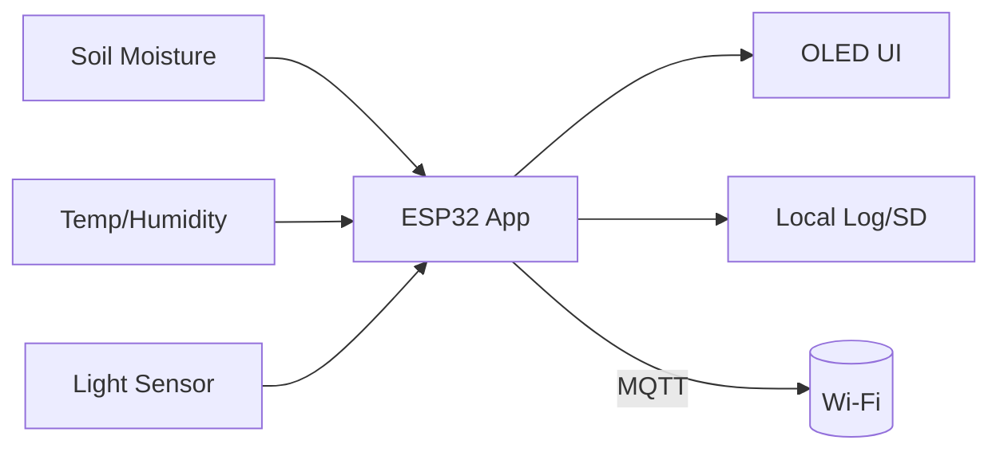

# Plant Monitor (ESP32)

Real-time soil moisture, temperature, humidity, and light monitoring on ESP32 with OLED display, and local logging.

[](#firmware-build--flash)
[](#hardware)

## ✨ Features
- Live sensors: **Soil moisture**, **Temp/Humidity** (DHT22), **Ambient Light** (Photoresistor).
- **OLED status UI** (watering hints, sensor levels/icons).
- **On-device thresholds** & visual alert (LED).
- **Config file** on SPIFFS/LittleFS (`config.json`).
- **Low-power mode** (deep sleep between reads).

---

## 📸 Demo
Add images or short GIFs here (OLED screen, assembled device, web dashboard).  
`/docs/images/overview.jpg` • `/docs/images/oled.gif`

---

## 🧱 Architecture


---

## 🔩 Hardware
| Block | Part (Example) | Interface | Notes |
|---|---|---|---|
| MCU | ESP32-DevKitC / WROOM | USB/Serial | 3V3 logic |
| Soil Moisture | Capacitive sensor v2.0 | ADC | Use 3V3 version; avoid resistive probes |
| Temp/Humidity | SHT31 (preferred) / DHT22 | I²C / 1-Wire | SHT31 = better accuracy |
| Light | BH1750 | I²C | Address 0x23/0x5C |
| Display | SSD1306 128×64 | I²C | 0x3C commonly |
| Optional | Buzzer/LED/SD Card | GPIO/I²C/SPI | Alerts & logging |

**Wiring (example):**
| Signal | ESP32 Pin | Notes |
|---|---|---|
| I²C SDA | GPIO21 | SHT31/BH1750/SSD1306 |
| I²C SCL | GPIO22 | — |
| Soil ADC | GPIO34 | Input-only pin |
| Buzzer | GPIO27 | Active buzzer or PWM |
| Status LED | GPIO2 | Pull-down recommended |

Schematic, PCB, and enclosure assets live in `/hardware` (e.g., `schematic.pdf`, `pcb/`, `stl/`).

---

## ⚙️ Firmware Build & Flash
### Option A: PlatformIO (recommended)
```bash
# clone
git clone https://github.com/<you>/plant-monitor.git
cd plant-monitor/firmware

# build & flash
pio run -t upload

# monitor serial logs
pio device monitor -b 115200
```

### Option B: Arduino IDE
- Boards Manager → **ESP32** by Espressif.
- Libraries: `Adafruit SSD1306`, `Adafruit GFX`, `BH1750`, `Adafruit SHT31` (or DHT), `ArduinoJson`, `PubSubClient` (if MQTT), `LittleFS`.
- Open `firmware/src/main.cpp` → Select board → Upload → Serial Monitor @ 115200.

---

## 🗃️ Configuration
`/firmware/data/config.json` (uploaded to SPIFFS/LittleFS):
```json
{
  "wifi": { "enabled": false, "ssid": "YOUR_SSID", "pass": "YOUR_PASS" },
  "mqtt": { "enabled": false, "broker": "192.168.1.10", "port": 1883, "topic": "plants/fern01" },
  "sampling_sec": 60,
  "moisture": { "min": 0.30, "max": 0.70, "cal_probe_air": 2700, "cal_probe_water": 1350 }
}
```
- `cal_probe_air` and `cal_probe_water` are raw ADC readings used for normalization:  
  `moisture_norm = (raw - air) / (water - air)` clamped to `[0,1]`.

Upload FS data (PlatformIO):
```bash
pio run -t uploadfs
```

---

## 🧪 Calibration Procedure
1. **Soil probe (air):** Dry the probe; record raw ADC as `cal_probe_air`.
2. **Soil probe (water):** Submerge in water; record raw ADC as `cal_probe_water`.
3. **Light:** Compare BH1750 reading to a known lux reference or phone app; note offset if needed.
4. **Temp/Humidity:** Cross-check SHT31 with a known sensor (±2% RH, ±0.3 °C typical).
5. Update `config.json` and reboot.

---

## 📤 Data Model / Output
**Serial JSON (one line per sample):**
```json
{
  "ts": 1739999999,
  "moisture": 0.56,
  "temp_c": 24.8,
  "rh": 47.2,
  "lux": 320,
  "alert": false,
  "vbat": 3.78
}
```

**MQTT (if enabled):**
- Topic: `plants/<device_id>` (configurable)  
- Payload: same JSON as above.

---

## 🔌 Power & Sleep (Optional)
- Active read + OLED draw: ~40–80 mA (depends on Wi-Fi).
- Deep sleep between samples to extend battery life:
  - Example: wake every 5 min, read 1 s, publish, sleep.
- Disable OLED in headless mode to save ~8–15 mA.

---

## ✅ Self-Test & Bring-Up
- **Serial**: Boot banner + config dump at 115200.
- **I²C scan**: Logs found devices (0x3C, 0x23, 0x44, etc.).
- **ADC sanity**: Prints raw moisture and normalized value.
- **UI**: OLED shows icons + moisture bar.
- **Alarm**: Force thresholds via serial command to test buzzer/LED.

---

## 🧰 Repo Layout
```
plant-monitor/
├─ firmware/
│  ├─ src/               # main.cpp, drivers/, mqtt/, ui/
│  ├─ include/
│  ├─ lib/               # third-party libs (if vendored)
│  ├─ platformio.ini
│  └─ data/              # config.json (FS)
├─ hardware/
│  ├─ schematic.pdf
│  ├─ pcb/
│  └─ enclosure/
├─ docs/
│  ├─ images/
│  └─ wiring.md
├─ test/                 # host-side unit tests, golden logs
└─ README.md
```

---

## 🧪 Testing
- **Unit (host)**: normalize + threshold logic in `/test` (run with `ctest` or `pytest`).
- **Golden logs**: `/test/golden/*.jsonl` compared against device output.
- **Hardware-in-loop**: simple pass/fail script checks field ranges.

---

## 🐛 Troubleshooting
- **Nothing on OLED** → Check I²C wires, address `0x3C`, supply 3V3.
- **Moisture stuck** → Wrong ADC pin; capacitive sensor requires 3V3 and stable ground.
- **NaN/inf in JSON** → Sensor init failed; watch boot log for I²C scan.
- **MQTT not publishing** → SSID/pass wrong; broker unreachable; topic not set.

---

## 🗺️ Roadmap
- Web dashboard (ESP32 AP + captive portal).
- OTA firmware updates.
- SD card CSV logging.
- Auto-watering relay output.
- Prometheus/InfluxDB exporter.

---

## 📚 References
- ESP-IDF / Arduino-ESP32 docs  
- Sensors: BH1750, SHT31, SSD1306 datasheets

---

## 🤝 Contributing
PRs welcome. Please run tests and follow the code style in `firmware/CONTRIBUTING.md`.

---

## 📝 License
MIT — see [`LICENSE`](LICENSE).

---

## 📄 Citation (if used in coursework)
If you reference this in a report, cite as:
> Plant Monitor (ESP32), <Your Name>, v1.0, https://github.com/<you>/plant-monitor
