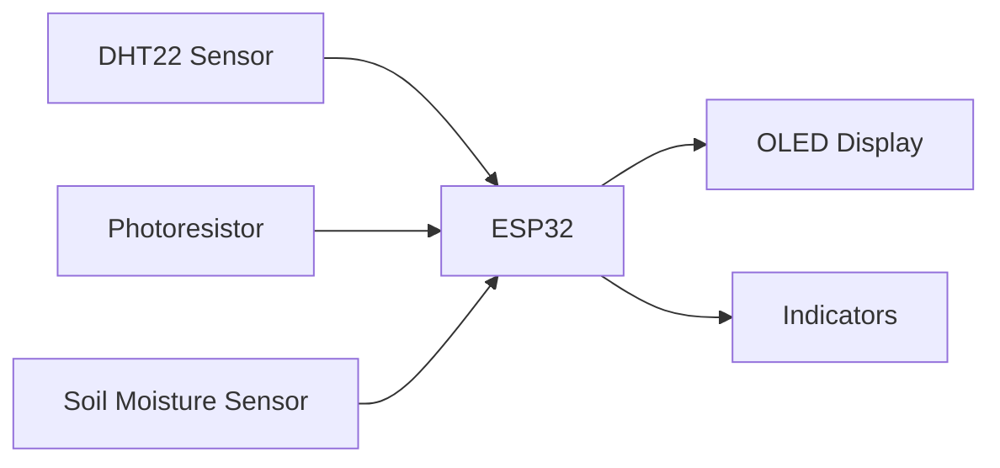

# Plant Monitor (ESP32)

Real-time soil moisture, temperature, humidity, and light level monitoring using an ESP32 microcontroller with OLED display and DHT22 + photoresistor sensors.

[](#firmware-build--flash)
[](#hardware)

## ✨ Current Features
- **Sensors**
  - DHT22 for temperature and humidity  
  - Capacitive soil moisture sensor  
  - Photoresistor for ambient light levels  
- **Display:** Live sensor readings on 0.96" SSD1306 OLED  
- **Threshold alerts:** Visual indicators when soil moisture or light levels fall out of range  
- **Configurable sampling interval** via firmware constants  
- **Calibration routine** for soil moisture sensor

---

## 🧭 Planned Features
- **Wi-Fi connectivity** for remote data monitoring  
- **Local data storage** using SPIFFS or SD card  
- **Web dashboard** for live visualization and configuration  
- **MQTT support** for IoT integration  
- **OTA firmware updates** for easy upgrades  

---

## 📸 Demo
Waiting on Component...

---

## 🧱 System Overview


---

## 🔩 Hardware
| Component | Example | Interface | Notes |
|------------|----------|------------|-------|
| MCU | ESP32-DevKitC / WROOM | USB / 3V3 logic | Main controller |
| Temp/Humidity | DHT22 | Digital (GPIO) | Single-wire protocol |
| Soil Moisture | Capacitive Sensor v2.0 | Analog (ADC) | Use 3.3V version |
| Light Sensor | Photoresistor + 10 kΩ divider | Analog (ADC) | Calibrate for ambient range |
| Display | SSD1306 128×64 | I²C | Address 0x3C |
| Optional | Buzzer or LED | GPIO | For alerts |

**Example Wiring**
| Signal | ESP32 Pin | Notes |
|---------|------------|-------|
| I²C SDA | GPIO21 | OLED |
| I²C SCL | GPIO22 | OLED |
| Soil Sensor | GPIO34 | Analog input |
| Photoresistor | GPIO35 | Analog input |
| DHT22 | GPIO27 | Digital input |

---

## ⚙️ Firmware Build & Flash
### Option A: PlatformIO (recommended)
```bash
# clone
git clone https://github.com/<you>/plant-monitor.git
cd plant-monitor/firmware

# build & flash
pio run -t upload

# monitor serial logs
pio device monitor -b 115200
```

### Option B: Arduino IDE
- Boards Manager → **ESP32** by Espressif  
- Libraries: `Adafruit SSD1306`, `Adafruit GFX`, `DHT sensor library`, `Adafruit Unified Sensor`  
- Open `firmware/src/main.cpp`, select board, upload, and monitor at 115200 baud  

---

## 🧪 Calibration Procedure
1. **Soil probe (air):** Dry the probe and record ADC value.  
2. **Soil probe (water):** Submerge in water and record ADC value.  
3. Update thresholds in code accordingly.  
4. Rebuild and flash firmware.

---

## 📤 Example Serial Output
```json
{
  "moisture": 0.56,
  "temp_c": 24.8,
  "rh": 47.2,
  "light": 320
}
```

---

## 🧰 Repo Layout
```
plant-monitor/
├─ components/           # Reusable ESP-IDF modules (e.g., DHT driver, display)
├─ main/                 # Application entry (main.c / main.cpp)
├─ CMakeLists.txt        # Build configuration
├─ .gitignore
└─ README.md
```

---

## 🧪 Testing & Validation
- **Serial Monitor:** Confirms sensor readouts at set interval  
- **OLED Output:** Displays live values (°C, %, Lux, Soil %)  
- **ADC Verification:** Compare readings under different lighting and soil conditions  

---

## 🗺️ Roadmap
- [ ] Wi-Fi connectivity (ESP32 Wi-Fi API)  
- [ ] SPIFFS/SD local logging  
- [ ] Web dashboard for visualization  
- [ ] Auto-watering relay system  
- [ ] Power optimization with deep sleep  

---

## 📚 References
- DHT22 datasheet  
- ESP32 ADC/I²C documentation  
- SSD1306 display datasheet  
- Capacitive soil sensor v2.0 resources
